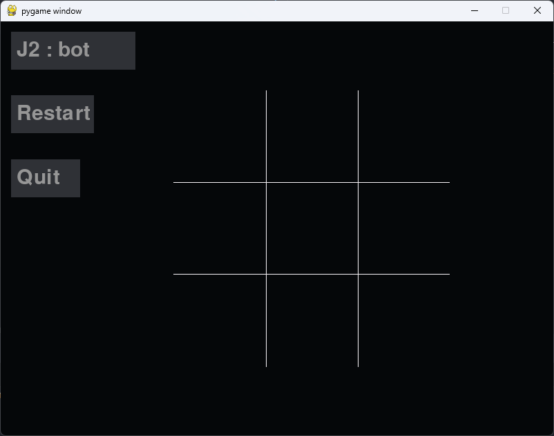

# TicTacToeAi
## Description

This is an implementation of the TicTacToe game. You can play with your friend on the same machine or against the computer. 

The computer uses the minimax algorithm to find the best move.

## Installation
```commandline
pip install -r requirements.txt
```

## Usage
```commandline
python main.py
```

